# OrbitBox

<p align="center">
  
</p>

<p align="center">
  <strong>Secure, elastic sandbox infrastructure concept for AI-generated code.</strong>
</p>

<p align="center">
  <a href="https://daytona-inspired-site.vercel.app">Live Demo</a>
  ·
  <a href="#quickstart">Quickstart</a>
  ·
  <a href="#public-usage-guide">Usage Guide</a>
  ·
  <a href="#security--public-safety">Security Notes</a>
</p>

---

## Overview

OrbitBox is a public-facing Next.js landing page and documentation concept for running AI-generated code inside isolated runtime sandboxes.

The project explains how an AI agent can receive a clean, disposable workspace with filesystem access, process execution, preview URLs, snapshots, and human-in-the-loop review before anything is shipped.

> **Important:** OrbitBox in this repository is a public demo/concept website. The commands and API examples below use placeholders and sample domains. Do not treat them as production credentials or a real hosted control plane.

## Live Demo

- Website: https://daytona-inspired-site.vercel.app
- Repository: https://github.com/Orbitbox2026/orbitbox

## What OrbitBox Demonstrates

OrbitBox presents a safe workflow for untrusted or AI-generated code:

1. **Create** an isolated sandbox from a template or snapshot.
2. **Run** commands, package installs, scripts, and long-running processes.
3. **Preview** web apps through a controlled URL before publishing.
4. **Snapshot** a verified state for reuse.
5. **Dispose** the sandbox to release resources and remove ephemeral data.

The landing page and docs section cover:

- full composable computers for AI agents;
- isolated runtime boundaries;
- fast sandbox startup;
- filesystem and process execution;
- preview URLs and PTY access;
- snapshots for persistent agent workflows;
- human review before shipping;
- public-safe quickstart and conceptual API examples.

## Public Usage Guide

Use this repository as a public demo site, design reference, or starting point for a documentation-heavy landing page.

### 1. Clone the repository

```bash
git clone https://github.com/Orbitbox2026/orbitbox.git
cd orbitbox
```

### 2. Install dependencies

```bash
npm install
```

### 3. Run locally

```bash
npm run dev
```

Open:

```text
http://localhost:3000
```

### 4. Build for production

```bash
npm run build
```

### 5. Start the production build locally

```bash
npm run start
```

## Example Sandbox Flow

The examples below are intentionally public-safe. Replace placeholder values with your own values in a private environment only.

```bash
# Example only — placeholder value, not a real secret
export ORBITBOX_API_KEY=<YOUR_API_KEY>

# Create an isolated workspace
orbitbox sandbox create ai-worker --snapshot node-20

# Execute a command inside the sandbox
orbitbox exec ai-worker -- npm install express

# Start a server through an interactive PTY session
orbitbox exec ai-worker --pty -- node /app/server.js

# Read the preview URL
orbitbox sandbox info ai-worker --json

# Save a verified state
orbitbox snapshot create ai-worker --name baseline-v1

# Dispose the sandbox when finished
orbitbox sandbox dispose ai-worker
```

## Conceptual API Example

The API sample uses a fake base URL and redacted authorization header. Keep real tokens in private environment variables and never commit them to GitHub.

```http
POST https://api.orbitbox.example/v1/sandboxes
Authorization: Bearer <YOUR_API_TOKEN>
Content-Type: application/json

{
  "name": "ai-worker",
  "snapshot": "node-20",
  "region": "example-region-1",
  "resources": {
    "cpu": 2,
    "memory": "4GiB",
    "disk": "20GiB"
  },
  "network": {
    "egress": "restricted",
    "preview": true
  }
}
```

Example response:

```json
{
  "id": "sbx_example_123",
  "status": "ready",
  "preview_url": "https://ai-worker.preview.example",
  "created_at": "2026-01-01T00:00:00Z"
}
```

## Documentation Structure

The website includes a GitBook-style documentation section with:

- **left sidebar** for document navigation;
- **main article column** for sequential explanations;
- **right mini table of contents** for section anchors;
- **mobile menu** so all navigation links remain visible on small screens;
- public-safe examples using placeholders instead of secrets.

Main topics:

1. Overview OrbitBox
2. Sandbox concept
3. Lifecycle: create → run → preview → snapshot → dispose
4. Security model
5. Agent workflow
6. Quickstart
7. Conceptual API
8. FAQ

## Design Direction

OrbitBox uses a blue/cyan/navy visual system inspired by the cube-orbit logo. The GitHub README includes an animated SVG hero to communicate the product concept without relying on private media assets.

Visual elements:

- animated 3D cube sandbox;
- orbital runtime rings;
- AI/API/PTY nodes;
- terminal-style status panel;
- blue/cyan glow system;
- responsive landing page sections;
- reduced-motion support on the website.

## Tech Stack

- Next.js App Router
- React
- TypeScript
- CSS animations
- SVG animation for GitHub README
- Vercel deployment

## Project Structure

```text
.
├── assets/
│   └── orbitbox-3d.svg        # animated public README graphic
├── public/
│   └── orbitbox-logo.jpg      # site logo and favicon source
├── src/
│   ├── app/
│   │   ├── globals.css        # visual system and responsive styles
│   │   ├── layout.tsx         # metadata and root layout
│   │   └── page.tsx           # landing page + docs content
│   └── components/
│       ├── Header.tsx         # desktop/mobile navigation
│       └── Logo.tsx           # logo and social icons
├── package.json
└── README.md
```

## Security & Public Safety

This repository is prepared for public usage. Keep it safe by following these rules:

- Do **not** commit `.env`, `.env.local`, `.vercel/`, API tokens, SSH keys, database URLs, or provider credentials.
- Use placeholders such as `<YOUR_API_KEY>`, `<API_BASE_URL>`, and `<PROJECT_ID>` in public docs.
- Store real secrets only in local environment files or platform secret managers.
- Avoid publishing private hostnames, account IDs, deployment tokens, raw logs, or internal infrastructure diagrams.
- Review generated docs and screenshots before committing them.

Already ignored by `.gitignore`:

```text
node_modules/
.next/
out/
build/
dist/
.env*
!.env.example
.vercel/
*.pem
```

## Available Scripts

```bash
npm run dev      # start the development server
npm run build    # create a production build
npm run start    # run the production build
```

## Deployment

The public demo is deployed on Vercel. For your own deployment:

1. Fork or clone this repository.
2. Import the repository into your Vercel account.
3. Use the default Next.js build settings.
4. Add any private environment variables through the Vercel dashboard, not through Git.

## License / Usage

This repository is a public demo and design concept for OrbitBox. If you reuse it, keep the public documentation sanitized and replace placeholders with your own private configuration outside of Git.
